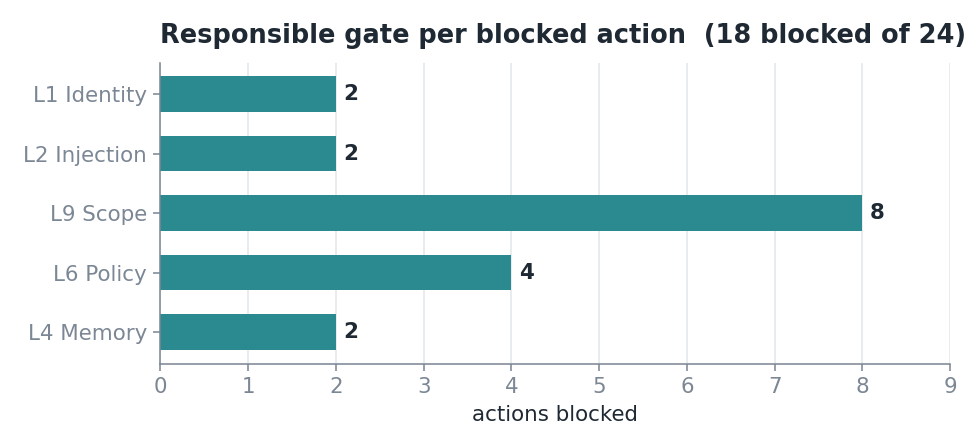
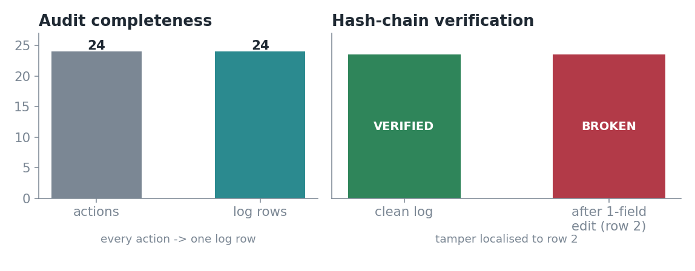
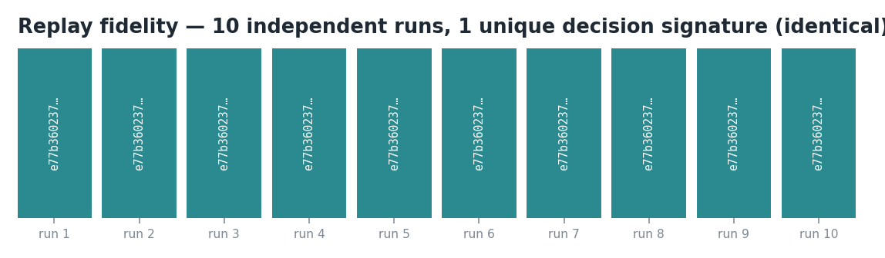

# Empirical Study: What Zink's Surfaces Actually Capture

*An instrumented evaluation of deterministic governance over LLM-agent tool calls.*

## Question

Regulation and safety frameworks ask deployers to *log, enforce, oversee, and
produce evidence* about agent behaviour, but are silent on whether a given tool
actually delivers those properties. This study asks a narrow, falsifiable
question about Zink specifically:

> When an instrumented agent is run through a task suite, do Zink's surfaces
> capture what they claim to — every action gated by the correct layer, every
> action logged, the log tamper-evident, and the decisions reproducible?

The claim under test is **"Zink produces real, complete, tamper-evident
governance evidence and enforces deterministically"** — *not* "Zink is robust
against adversarial agents." The distinction matters and is revisited under
[Limitations](#limitations).

## Method

**Subjects.** The two example agents shipped with Zink — an expense-approval
agent and a cloud-infrastructure agent — wrapped through Zink's standard
interception path (`zink.govern(...)`), with the deny-list, scope constraints,
injection patterns, dedup, and identity layers configured per their YAML.

**Task suite.** 24 labelled cases (`study/suite.py`) spanning every violation
class Zink is designed to gate, plus valid actions that must pass:

| Class | Cases | Expected outcome |
|---|---|---|
| Valid action | 6 | PASS |
| Unauthorized caller | 2 | BLOCK — L1 |
| Prompt injection (in params) | 2 | BLOCK — L2 |
| Constraint violation (amount, env, type, category) | 4 | BLOCK — L9 |
| Denied / out-of-scope tool | 4 | BLOCK — L9 |
| Conditional policy violation (out-of-hours, weekend) | 4 | BLOCK — L6 |
| Duplicate / replay | 2 | BLOCK — L4 |

Each case carries ground truth: the expected decision (PASS/BLOCK) and, for
blocks, the layer that *should* be responsible (the first blocking gate in
pipeline order L1→L2→L9→L6→L4).

**Controlled variables.** Base context (caller, hour, weekday) is held fixed
for the core cases. Cases exercising identity and policy blocks use variant
contexts (unauthorized caller, out-of-hours, weekend) with all other params
held valid, isolating the layer under test. Each governed function is keyed by
`(agent, resource, context)` so stateful layers (dedup, rate limits) are
correctly shared across cases that use the same context and correctly isolated
across those that do not.

**Measurements.** Decision correctness; responsible-layer attribution (parsed
from each audit row's `layer_trace`); audit completeness (rows written vs actions
executed); tamper-evidence (chain verification on a clean log, then after a
single-field edit to one row); and determinism (N=10 independent runs from
identical fresh state, comparing a SHA-256 signature over the decision sequence).
Determinism is measured over the **control-plane decision** — approval, reason,
responsible layer — never the wrapped tool's own return value, which Zink does
not govern.

## Results

**1. Decision correctness — 24/24 (100%).** Every action was allowed or blocked
exactly as specified.

**2. Layer attribution.** Each block was owned by the correct gate.



Layer attribution reflects the three-tier pipeline design: scope (L9) owns all
authorization — static deny-list enforcement, in-scope membership, and parameter
constraints — while policy (L6) owns only conditional and transient rules
(business hours, weekends, rate limits) that apply after scope has already
permitted the action. Denied and out-of-scope tools are therefore correctly
attributed to L9, not L6.

**3. Audit completeness — 24/24.** Every action, whether passed or blocked,
produced exactly one audit row. No action bypassed the log.

**4. Tamper-evidence.** The clean log verifies. A single-field edit to one
stored row breaks verification, and the break localises to that exact row.



**5. Determinism / replay fidelity — 10/10 identical.** Ten independent runs from
identical fresh state produced one identical decision signature.



## Interpretation

The five results together support the bounded claim: for the specified policy,
Zink gates each action at the correct layer, logs every action, produces a log
whose integrity is mechanically verifiable and whose tampering is localisable,
and reaches the same decisions on replay. This is the evidence the EU AI Act
(Art. 12/19 logging, Art. 72 monitoring), NIST AI RMF (MEASURE/MANAGE), and
ISO/IEC 42001 (monitoring) ask deployers to produce — generated as a by-product
of enforcement rather than assembled after the fact.

Two of these are properties of the construction rather than discoveries:
determinism follows from rule-based gating, and tamper-evidence from the hash
chain. They are reported here as *verification that the implementation delivers
what the design promises*, which is the honest weight to give them — not as novel
findings.

## Limitations

- **Scripted suite, deterministic stub tools.** This measures that Zink's
  surfaces capture what is sent through them, not that Zink catches real-world
  adversarial agent behaviour. Coverage against an adaptive adversary is out of
  scope and unmeasured.
- **Injection detection is regex-based (L2).** Precision/recall against a
  motivated adversary is not characterised here; L2 is defence-in-depth, not the
  primary control. The primary control is action-boundary gating (L6/L9).
- **Determinism is scoped to the control-plane decision**, not the wrapped tool's
  output, which remains whatever the tool is.
- **Single process, single store.** Multi-process and multi-agent delegation are
  not exercised; the audit chain and dedup are single-writer.

## Reproduce

```bash
pip install -e .
python -m study.run_study      # -> study/out/results.json (+ console summary)
python -m study.figures        # -> study/out/fig1..3.png
```

All numbers and figures in this report regenerate from those two commands.